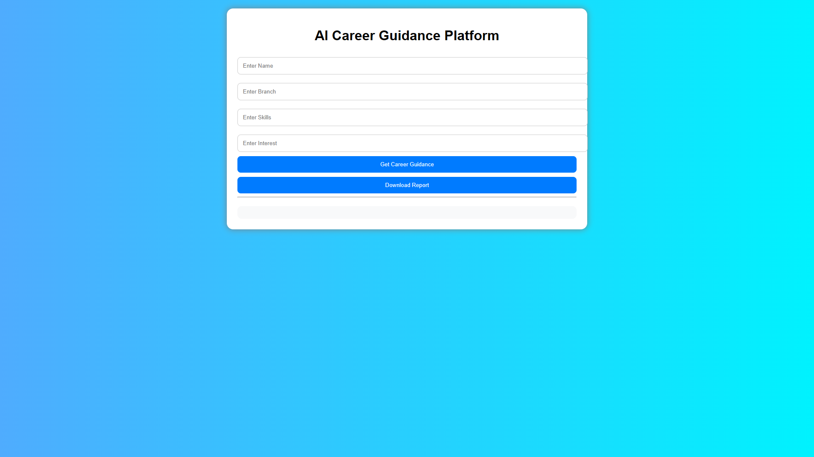
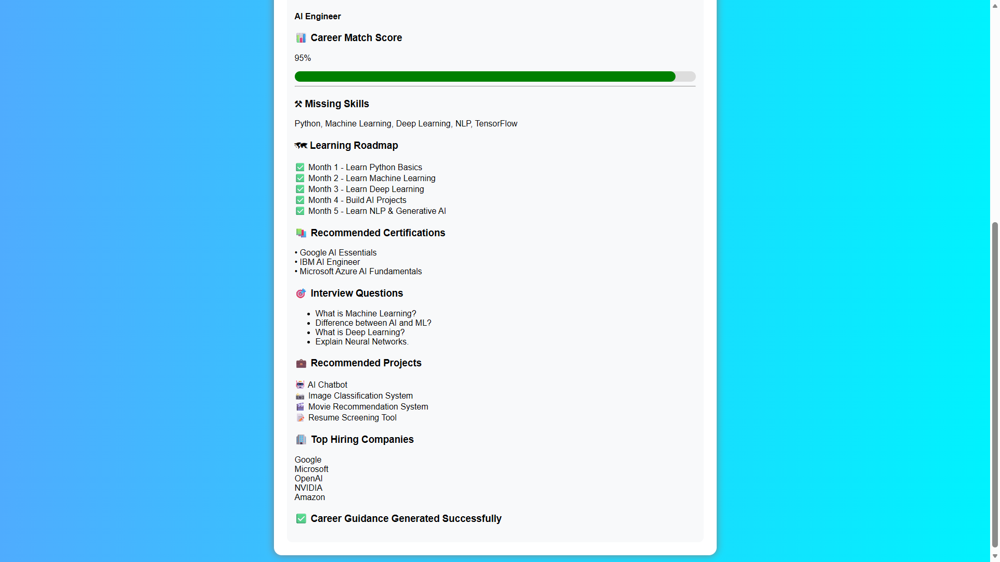
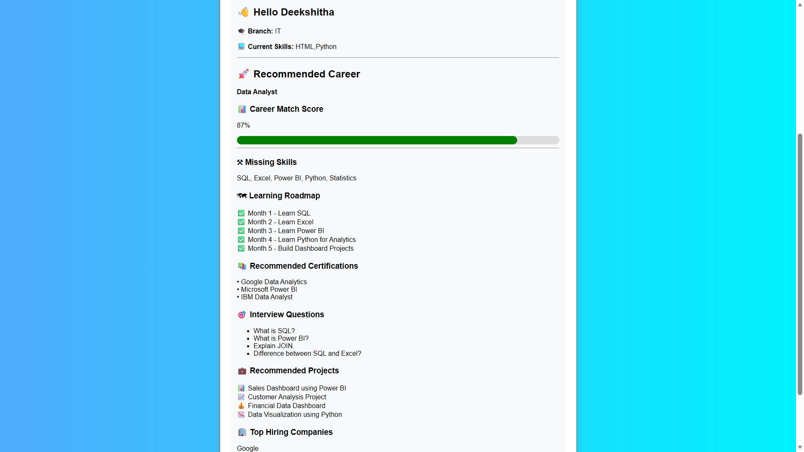
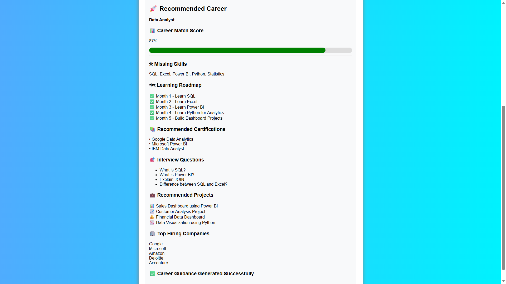
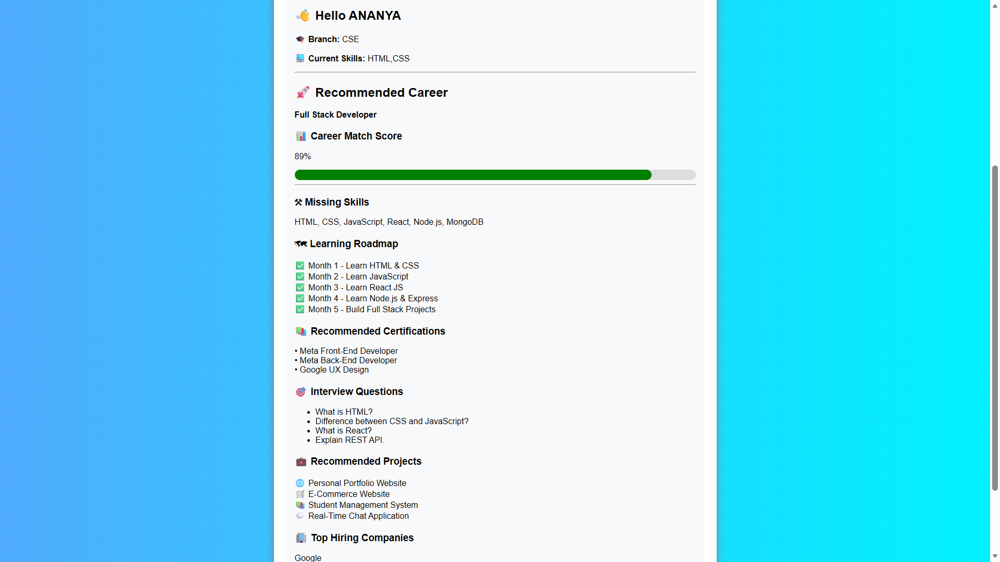
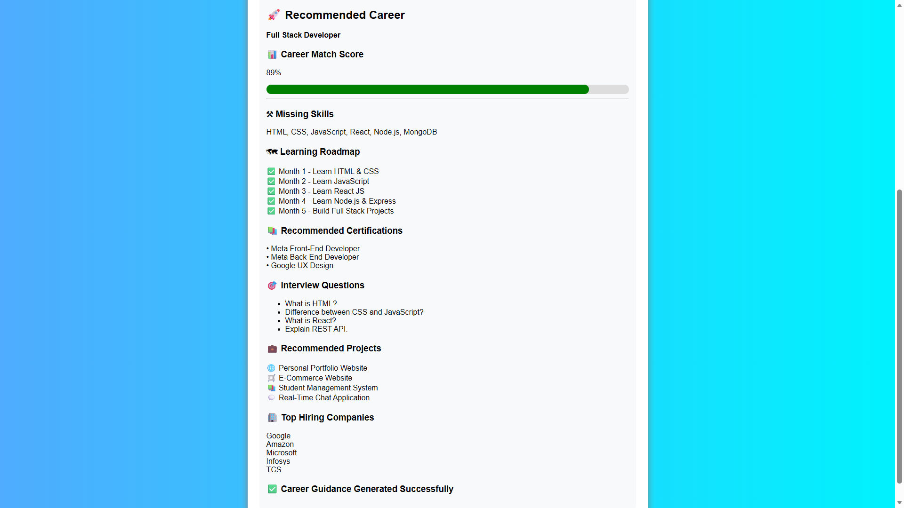

# AI Career Guidance Platform

An AI-powered career recommendation platform built using HTML, CSS, and JavaScript.

## Features
- Career Recommendations
- Career Match Score
- Skill Gap Analysis
- Learning Roadmap
- Certifications
- Interview Questions
- Project Recommendations
- Top Hiring Companies
- PDF Report Download

## Technologies Used
- HTML
- CSS
- JavaScript

## Project Structure
- index.html
- style.css
- script.js

## Screenshots

### Home Page

### AI Engineer Output

### Data Analyst Output 1

### Data Analyst Output 2

### Full Stack Developer Output 1

### Full Stack Developer Output 2

## Author
Budida Siri
